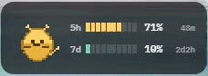

# 🐱 Claude Usage Widget


[](LICENSE)

Meet **Nibble** — a tiny pixel-art cat who lives on your desktop and keeps an eye on your Claude Code usage so you don't have to. No terminal commands, no dashboard tab, no guessing when your limit resets. Just glance at Nibble.



## Why you'll like it

- 📊 **Two live bars** — your 5-hour and 7-day usage windows, each with its own color and reset countdown
- 😼 **Nibble reacts** — calm, busy, anxious, or critical, Nibble's mood (and the bars) shift as you get closer to your limit
- 🔔 **A heads-up when it matters** — a Windows toast at 85% and 100%, so you're never caught off guard mid-session
- 📌 **Stays out of your way** — always-on-top, draggable, no taskbar icon

## Getting started

You'll need:

- Windows 10 or 11
- [Claude Code](https://claude.com/claude-code) installed and signed in (`claude login`)

Then:

1. Grab the latest installer from [Releases](../../releases)
2. Run it — no admin rights required
3. Drag Nibble wherever you like and get back to work

## How it works

Nibble reads the same OAuth token Claude Code already keeps at `~/.claude/.credentials.json` and checks the same usage endpoint Claude Code's own UI uses. There's no separate login and no extra account — it just quietly watches the session you already have.

## Privacy, plainly

- **Reads** `~/.claude/.credentials.json` — read-only, never modified
- **Talks to** `api.anthropic.com` only, to fetch your usage
- **Saves locally** your window position and a startup preference, under `%APPDATA%\usage-board\`
- **No analytics, no telemetry, no backend of ours** — it's just you, Nibble, and Anthropic's API

## Contributing / running from source

```powershell
npm install
npm run tauri dev
```

See [CONTEXT.md](CONTEXT.md) for the project's vocabulary and [CLAUDE.md](CLAUDE.md) for the contribution workflow.

## License

MIT — see [LICENSE](LICENSE).
